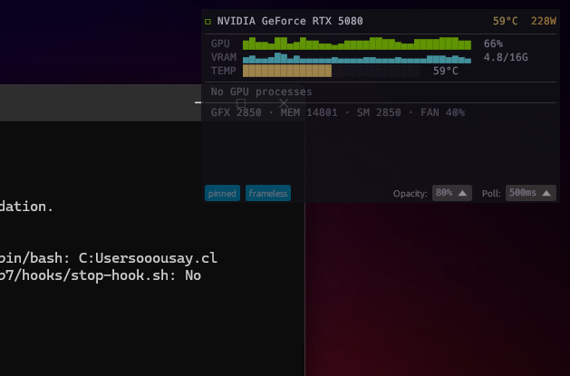

# nvdash

A lightweight, native NVIDIA GPU monitor for ML workloads. No web views, no Electron — just a compact GPU peek widget built with [egui](https://github.com/emilk/egui) and [nvml-wrapper](https://github.com/Cldfire/nvml-wrapper).



## Features

- **Compact UI (~380x240)** — everything visible at a glance, no scrolling
- **Inline metric bars** — GPU utilization, VRAM, temperature, and power with heat-colored bars
- **Mini sparklines** — custom-painted GPU % and VRAM history (last 60s)
- **Clock summary** — GFX, MEM, SM clocks and fan speed in a single line
- **Process summary** — process count and top 2 by VRAM usage
- **Driver/CUDA info** — hover the GPU name for driver and CUDA versions
- **500ms polling** — real-time updates without hammering the GPU

## Requirements

- NVIDIA GPU with drivers installed
- [NVML](https://developer.nvidia.com/management-library-nvml) (ships with NVIDIA drivers)

## Build

```
cargo build --release
```

## Run

```
cargo run --release
```

## License

MIT
